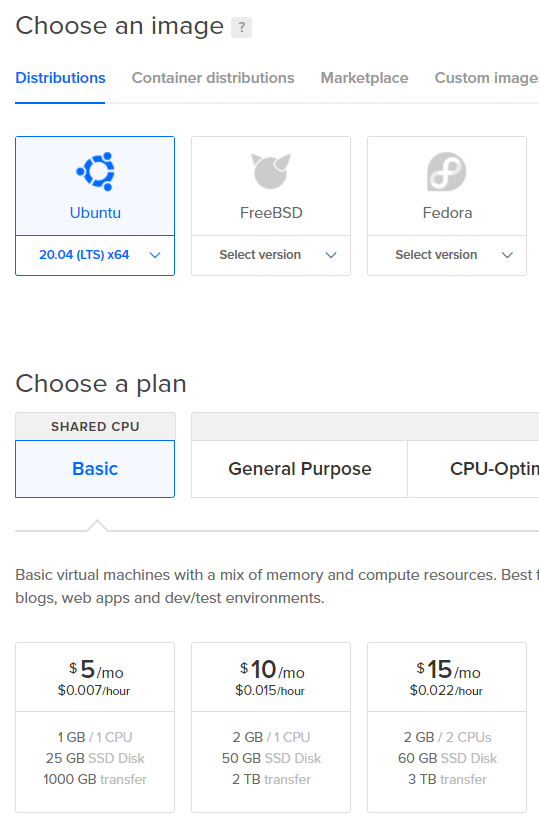
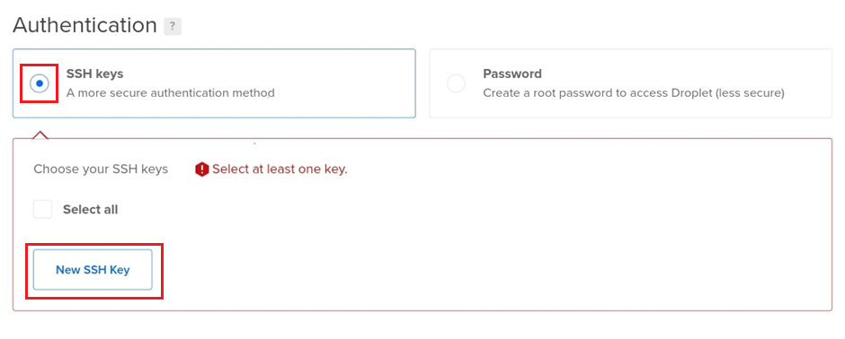
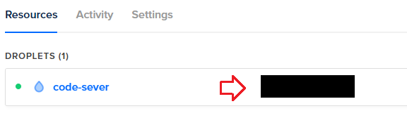

In this article, I will show you how to turn your Android device into a machine for web development with .NET 5. For the sake of fun, we will do all the necessary configuration steps directly on a tablet without the aid of another computer. The basic idea is to use [code-server](https://github.com/cdr/code-server), which enables us to run VsCode on a remote machine and access it in a browser.
<!-- end -->

## Set up a virtual machine

We are going to use [DigitalOcean](https://www.digitalocean.com/) as a provider for our virtual machine (VM). DigitalOcean offers a Droplet (Linux-based VM) with an already configured code-server. The problem is that it contains an old version of code-server, and I had a hard time trying to update it to the newest version. Therefore, we will go with the clean Ubuntu Droplet, and we will install code-server ourselves.



The cheapest option is enough for our testing, but you can go with the $10/mo options if you plan to do some serious stuff. The nice thing about DigitalOcean is that you are charged only for the time when the VM is allocated to you. So, you can even go with the $80/mo option, play with the VM for an hour, then destroy it, and you are going to be charged only $0.119.

We are going to use SSH for accessing our server during setup. For this, we can use Termux, which is an Android terminal emulator and Linux environment app. You can use Termux for many development related tasks - even to install NodeJS and use it to develop web applications to some degree. Sadly, at least at the time of writing this article, it is impossible to use it for .NET development. But it is worth to keep an eye on Termux/.NET compatibility for the future - <https://github.com/termux/termux-packages/issues/516>.

For SSH access, we first need to generate an SSH key, so let’s install OpenSSH.

```bash
pkg upgrade 
pkg install openssh
```

And then generate our SSH key pair.

```bash
ssh-keygen -t rsa -b 2048
```

Keep the default location when prompted, and then print the public SSH key.

```bash
cat ~/.ssh/id_rsa.pub
```

We can now go back to the Droplet setup and enter the public key in the Authentication section.



And that’s it. You can also change the name of the server and then finish the creation of the server. It will take only a few seconds for the setup to finish.

Let’s go back to Termux and run the following command to connect to the newly created server.

```bash
ssh root@[ip address of your server]
```

You can obtain the IP address from the list of Droplets.



## code-server user

Before we install code-server, we need to prepare a user under which code-server will run. The reason for this is that code-server enables us to run commands directly on the server through the terminal in VsCode, and it is safer if we don’t run them under the root user by default.

Let’s create a new user using the following command.

```bash
adduser codeuser
```

You can, of course, pick any name you like instead of “codeuser”. To run administrative tasks under the “codeuser” user using the “sudo” command, we need to add the user to the “sudo” group.

```bash
usermod -aG sudo codeuser
```

## code-server

We are now ready to install code-server. We will use the official code-server [documentation](https://github.com/cdr/code-server/blob/master/doc/guide.md#2-install-code-server) as a guide, but mind that the guide also contains steps for creating a VM on Google Cloud, but we already have one. Therefore, we can skip right to the installation of code-server package.

```bash
curl -fsSL https://code-server.dev/install.sh | sh
```

Let’s enable the code-server service using the following command.

```bash
systemctl enable --now code-server@codeuser
```

The “codeuser” string after the “@” character specifies that the code-server service should run under the user we created before. From the technical point of view, we have simply defined the instance’s identifier, which is used as a value for the “User=” option in the unit template.

We can see that by printing out the “/lib/systemd/system/code-server@.service” template.

```bash
cat /lib/systemd/system/code-server@.service
```

And inspecting the following line.

```
User=%i
```

## Expose code-server

We must expose code-server to the internet using a reverse proxy to access it through a browser. For the sake of security, we are going to expose code-server only through HTTPS. We will therefore need an SSL certificate. We can use [Let’s Encrypt](https://letsencrypt.org/), which provides SSL certificates for free. The only downside is that we also need a domain because Let’s Encrypt doesn’t offer certificates for plain IP addresses.

Our first step after obtaining a domain is to point it to the server IP. We can do that by creating an “A” record in the DNS configuration of your domain provider. Set the record’s value to the IP address of your server and Host to a subdomain that you like (e.g. “www”). Mind that the DNS propagation may take up some time (24-48 hours, but usually it is much faster).

We are going to use the [caddy](https://caddyserver.com/) server for the reverse proxy. It makes HTTPS setup with Let’s Encrypt really easy. First, we need to install caddy by following steps from the official [documentation](https://caddyserver.com/docs/install#debian-ubuntu-raspbian).

```bash
sudo apt install -y debian-keyring debian-archive-keyring apt-transport-https

curl -1sLf 'https://dl.cloudsmith.io/public/caddy/stable/cfg/gpg/gpg.155B6D79CA56EA34.key' | sudo apt-key add -

curl -1sLf 'https://dl.cloudsmith.io/public/caddy/stable/cfg/setup/config.deb.txt?distro=debian&version=any-version' | sudo tee -a /etc/apt/sources.list.d/caddy-stable.list

sudo apt update

sudo apt install caddy
```

Now let’s configure the reverse proxy. Replace the content of “/etc/caddy/Caddyfile” with:

```
[my-domain]
reverse_proxy 127.0.0.1:8080
```

Where “\[my-domain\]” is the domain that we configured “A” record for – e.g. “www.my-domain.com”.

Now, let’s reload the caddy server.

```bash
sudo systemctl reload caddy
```

We are ready to access the code server. Open “https://[my-domain]” in a browser (replace \[my-domain\] with your domain), and we will see the login screen of our code-server. We can find the password by running the following command.

```bash
cat ~codeuser/.config/code-server/config.yaml
```

If you wish to change it, modify the “config.yaml” file and reload the code-server service using the following command.

```bash
sudo systemctl restart code-server@codeuser
```

We can run the rest of the configuration directly from the VsCode terminal, and we may therefore close the SSH connection in Termux.

For additional security, we are going to enable the UFW firewall. We need to allow SSH connections and HTTPS connections on the default port (443).

```bash
ufw allow OpenSSH
ufw allow https
```

Now we can enable the firewall.

```bash
ufw enable
```

## Install .NET SDK

We can install the .NET SDK by following the steps from <https://docs.microsoft.com/en-us/dotnet/core/install/linux-ubuntu>.

Run the following command (for Ubuntu 20.04 - if you are using another Linux distribution, go to <https://docs.microsoft.com/en-us/dotnet/core/install/linux> and select it).

```bash
wget https://packages.microsoft.com/config/ubuntu/20.04/packages-microsoft-prod.deb -O packages-microsoft-prod.deb
sudo dpkg -i packages-microsoft-prod.deb
```

And then.

```bash
sudo apt-get update; \
    sudo apt-get install -y apt-transport-https && \
    sudo apt-get update && \
    sudo apt-get install -y dotnet-sdk-5.0
```

## Our first ASP.NET application

We are ready to create our first ASP.NET application using the code-server terminal in the usual way.

```bash
mkdir webapp1
cd webapp1
dotnet new web
```

And we can start it.

```bash
dotnet run
```

The only problem that is left before us is how to access the application because it runs on localhost on the remote server. We can, of course, inspect the response using curl.

```bash
curl http://localhost:5000
```

But that would be rather painful. We would typically create a reverse proxy in the caddy server to expose the local addresses, but code-server has us already covered. Just head to “https://[my-domain]/proxy/5000”, and we can see our ASP.NET application. That is because code-server acts as a simple reverse proxy where each request to the “/proxy/\[port\]” path is forwarded to the appropriate port.

## Conclusion

We have managed to create a development environment out of our Android device. And on top of that, we managed to do the whole setup from the Android device itself – so you can do it even on a bus :simple_smile: . If you own an iPad instead, then luckily, you can follow the same steps, but instead of Termux, you will use [Blink Shell](https://blink.sh/), or [Ish](https://ish.app/).

So, that’s it, happy coding\!

## Sources

  - <https://wiki.termux.com/wiki/Remote_Access>

  - <https://www.digitalocean.com/community/tutorials/initial-server-setup-with-ubuntu-20-04>

  - <https://github.com/cdr/code-server/blob/master/doc/guide.md#2-install-code-server>

  - <https://www.digitalocean.com/community/tutorials/understanding-systemd-units-and-unit-files>

  - <https://github.com/cdr/code-server/blob/master/doc/FAQ.md>
