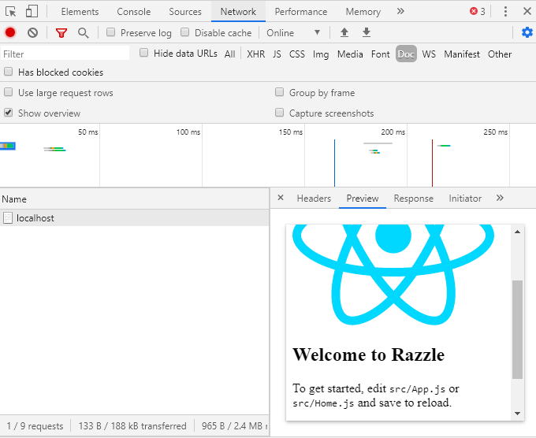
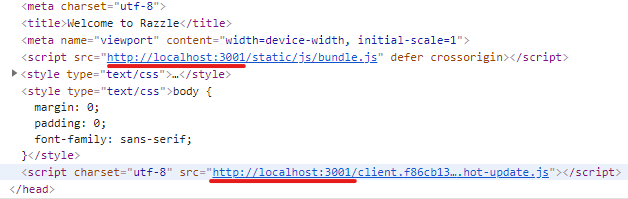
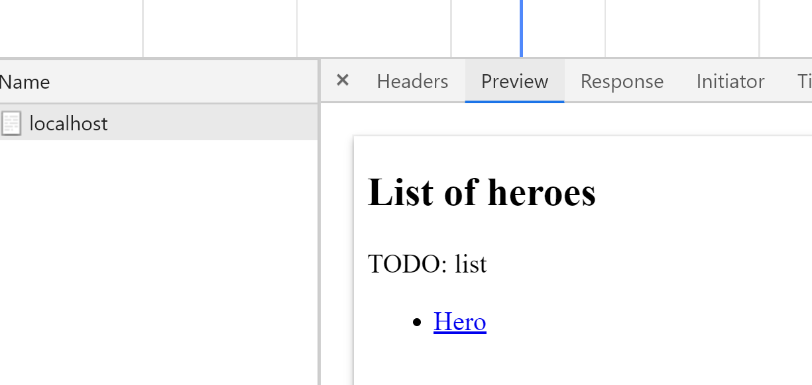

To create a React application with server-side rendering (SSR) in .NET, you can usually use a well-known library, [ReactJS.NET](https://reactjs.net/). Sadly, you might miss some useful features like code splitting or HMR ([Hot Module Replacement](https://webpack.js.org/concepts/hot-module-replacement/)). You are also constrained in which React libraries with SSR support you can use. E.g., in time of writing this article, there is no support for [Typography.js](https://kyleamathews.github.io/typography.js/).
<!-- end -->

What I’m going to present you in this two-part article, is an alternative way, where you have full control over the React side, while still keeping things simple thanks to [Razzle](https://github.com/jaredpalmer/razzle) and [Javascript.NodeJS](https://github.com/JeringTech/Javascript.NodeJS). We will also fully embrace React and replace Razor views in the ASP.NET Core application with it.

  - In the first part, we will take a quick look into Razzle. We will create a base Razzle application and integrate it with ASP.NET Core backend.

  - In the next part, we will add data loading to both the client and the server-side. We will explore possibilities of extending our application with cool stuff like code splitting and wrap up with publishing our application using Visual Studio.

## Why server-side rendering ?

By using server-side rendering, we can deliver HTML content with a single request. It has two main benefits. User doesn’t need to wait while all javascript assets are loaded and initialized to see the actual content, and we make it much easier for SEO bots to crawl our page.

## Why Razzle

A common way to create a React application is to use [create-react-app](https://github.com/facebook/create-react-app) (CRA). It allows us to focus on writing applications instead of wasting time with configuration. But sadly, it doesn’t come with server-side rendering, and without ejecting, we don’t have enough access to underlying Webpack configuration. Thankfully, there is a great alternative called [Razzle](https://github.com/jaredpalmer/razzle). Similarly to CRA, it works with zero configuration. But in contrast to CRA, Razzle gives us the power to tap into the build process and thus modify the Webpack configuration. On top of that, it comes with server-side rendering right out of the box, while still keeping server-side code in our power.

## Create Razzle App

We are going to use the standard React template provided by ASP.NET Core. Although it uses CRA, it still offers useful things, like base SpaServices configuration or publish configuration. Let’s run the following command to create the base of our application.

```sh
dotnet new react
```

Now we can focus on transforming CRA to Razzle. First, we will remove the whole ClientApp directory that contains the actual CRA client application and replace it with Razzle. Run the following command to initialize Razzle application inside of the ClientApp folder.

```sh
npx create-razzle-app ClientApp
```

We need to change the root path of SPA static files in the Startup.cs file. We will use a different path for development and production according to paths generated by Razzle.

```js
services.AddSpaStaticFiles(configuration =>
{
    configuration.RootPath = _env.IsDevelopment() ? "ClientApp/build" 
      : "ClientApp/build/public";
});
```

Next, we must remove the UseSpa code from the Configure method, because we are not going to use ASP.NET Core spa proxy (more on that later).

```js
app.UseSpa(spa =>
{
  …
});
```

## Razzle architecture

Razzle application has two entry points for two different Webpack bundles:

  - index.js – the entry point for the server-side bundle

  - client.js - the entry point for the client-side bundle

In the server.js file, we can see the actual server-side rendering inside of an Express server.

```js
const server = express();
server
  .get('/*', (req, res) => {
    const context = {};
    const markup = renderToString(
      <StaticRouter context={context} location={req.url}>
        <App />
      </StaticRouter>
    );
      res.status(200).send(
        `<!doctype html>
        ...
        ${markup}
        ...
        </html>`
      );
    ...
  });
```

The App component is the root of our React application (same as with CRA). This component is converted to an HTML string using renderToString provided by React and then sent to a client inside of an HTML template.

Let’s start the Razzle app to see how it works (for now without the ASP.NET Core part). Execute the following command in the ClientApp folder.

```sh
npm start
```

Razzle application is running on port 3000 (even if the output is saying that it is 3001 – more on that later), so let’s open <http://localhost:3000/> in our browser. We are greeted by the default Razzle app. By opening developer tools and checking the network tab, we can see the SSR in action.



The document returned from the server contains fully rendered HTML. If we make any change to the Home.js component, it gets updated in the browser automatically. So HMR is also working.

Now, what’s up with the [http://localhost:3001](http://localhost:3001/)? Razzle uses a smart trick to achieve client-side HMR and blazing fast recompiles during development. It runs a separate webpack-dev-server for client-side assets. To connect these assets with the server-side, Razzle explicitly sets “webpack.output.publicPath” to localhost:3001. Therefore if we examine the rendered HTML from [http://localhost:3000](http://localhost:3000/), we can see that scripts (alongside other assets) are actually hosted on [http://localhost:3001](http://localhost:3001/).



This trick is going to be quite helpful. Webpack will serve client-side assets for us independently of our ASP.NET Core side, and therefore, we will have HMR without any hassle. We won’t even need to use a proxy between ASP.NET Core and Webpack dev server in contrast to a CRA solution.

## Extending Razzle app

Let’s extend our application a little bit to be able to experiment with routing. For that, we will replace the Home.js component with two other components - HeroList.js and HeroDetail.js. For now, these will be just dummy components and we will extend them later.

```js
const HeroList = () => (
  <div>
    <h2>List of heroes</h2>
    <div>
      TODO: list 
          <ul>
        <li>
          <Link to="/1">Hero 1</Link>
        </li>
      </ul>
    </div>
  </div>
);
const HeroDetail = () => (
  <div>
    <h2>Hero ...</h2>
    <div>
      <Link to="/">Back to list</Link>
    </div>
    <div>
      TODO: Hero detail
        </div>
  </div>
);
```

We also need to create routes for our new components in App.js.

```js
<Switch>
  <Route exact path="/" component={HeroList} />
  <Route exact path="/:id" component={HeroDetail} />
</Switch>
```

Let’s check the http://localhost:3000/. We can see the HeroList component rendered, and clicking on the “Hero 1” link brings us to HeroDetail, as you would expect.

## ASP.NET Core integration

We have successfully created a base of our application, but the client-side (React/Razzle) and the server-side (ASP.NET Core) are still disconnected. It’s time to integrate both sides by introducing React server-side rendering into the ASP.NET Core backend.

### Rendering to string

We need to execute React rendering from the ASP.NET Core backend, but Razzle provides server-side rendering through an Express server by default. An easy way to achieve this integration is to use [Javascript.NodeJS](https://github.com/JeringTech/Javascript.NodeJS) library that enables us to call NodeJs scripts from .NET Core. We only need to replace the Express server with a simple function that just returns the rendered HTML.

```js
const server = (cb, url) => {
  const context = {};
  const markup = renderToString(
    <StaticRouter context={context} location={url}>
      <App />
    </StaticRouter>
  );
  
  cb(null, `<!doctype html>
      <html lang="">
      <head>
          <meta http-equiv="X-UA-Compatible" content="IE=edge" />
          <meta charset="utf-8" />
          <title>Welcome to Razzle</title>
          <meta name="viewport" content="width=device-width, initial-scale=1">
          ${assets.client.css
      ? `<link rel="stylesheet" href="${assets.client.css}">`
      : ''} 
          ${process.env.NODE_ENV === 'production'
      ? `<script src="${assets.client.js}" defer></script>`
      : `<script src="${assets.client.js}" defer crossorigin></script>`}
      </head>
      <body>
          <div id="root">${markup}</div>
      </body>
    </html>`);
}
```

The first parameter (cb) is a callback function to signal async completion to Javascript.NodeJS.

The entry point for the server-side is index.js, so we need to modify that one too.

```js
let app = require('./server').default;
module.exports = app;
```
We have removed all of the original code, and now we are just exporting the server.

We can now try out the server function. First, we need to build the Razzle application with the following command.

```sh
npm run build
```

This command generates a production bundle of our application in the “./build/server” directory. It includes the server.js file that contains the whole application built by Webpack.

To call the server function, just run the following command.

```sh
node -p "require('./build/server')((_,x)=>console.log(x), '/')"
```

Great, we can see the rendered HTML of our React application. We are making some progress, but we surely don’t want to call build each time we change something in our React part during development. Luckily, Razzle does this automatically for us when we start the application in development mode. There is just one little catch. Razzle creates a bundle that also contains server-side HMR, and it will get in our way. If we try to run our rendering function from the server.js generated in the development mode, it will keep running and waiting for changes. Therefore, we need to remove it. Thankfully, we can keep the client-side HMR, which is more significant for us. To remove the server-side HMR, we need to tap into the underlying Webpack configuration by creating a “razzle.config.js” file with a “modify” function.

```js
module.exports = {
    modify: (config, { target, dev }) => {
        if (target === 'node' && dev) {
            config.plugins = config.plugins.filter(p => 
              p.constructor.name !== 'HotModuleReplacementPlugin');
            config.entry = config.entry.filter(e => e !== 'webpack/hot/poll?300');
        }
        return config;
    },
};
```

Now, after we have disabled the server-side HMR, we are ready to start the development server again with the following command.

```sh
npm start
```

We can also try to rerun the server function.

```sh
node -p "require('./build/server')((_,x)=>console.log(x), '/')"
```

It prints HTML, same as in case of production bundle, but now, we can make changes to our React components, and by rerunning the command, we can see that the bundle was updated.

### Calling NodeJs from ASP.NET Core

Finally, we are ready to integrate our React client-side with the ASP.NET Core backend. For now, we will do it without any data coming from the ASP.NET Core backend.

We are going to use the already mentioned [Javascript.NodeJS](https://github.com/JeringTech/Javascript.NodeJS) library to call server.js from ASP.NET Core backend. So, let’s add it to our project through NuGet.

```sh
dotnet add package Jering.Javascript.NodeJS --version 5.4.0
```

We need to register it in the ConfigureServices method inside of the Startup.cs file.

```cs
services.AddNodeJS();
services.Configure<OutOfProcessNodeJSServiceOptions>(options =>
{
    options.EnableFileWatching = _env.IsDevelopment();
});
```

Well, that was rather simple, and we are ready to go. Let’s create a service for calling our function exported from server.js.

```cs
public class RenderService : IRenderService
{
    private const string ServerJsRelPath = "./ClientApp/build/server.js";
    private readonly INodeJSService _nodeJSService;
    private readonly string _serverJsPath;

    public RenderService(INodeJSService nodeJSService, 
      IWebHostEnvironment webHostEnvironment)
    {
        _nodeJSService = nodeJSService;
        _serverJsPath = webHostEnvironment.ContentRootFileProvider
          .GetFileInfo(ServerJsRelPath).PhysicalPath;
    }
    public Task<string> RenderAsync(string url) => 
        _nodeJSService.InvokeFromFileAsync<string>(_serverJsPath, 
          args: new object[] { url });
}
```

We are using ContentRootFileProvider.GetFileInfo to get the path to the server.js file. In RenderAsync, we are calling Javascript.NodeJS (InvokeFromFileAsync) to invoke the exported function in the server.js file. InvokeFromFileAsync returns whatever we send to the callback (cb) in the js function. In our case, it is HTML of the specified route provided as the “url” parameter.

We can now create a custom action result for executing React rendering from MVC actions.

```cs
public class SsrResult : IActionResult
{
    private readonly string _url;
    public SsrResult(string url)
    {
        _url = url;
    }
    public async Task ExecuteResultAsync(ActionContext context)
    {
        var renderService = context.HttpContext.RequestServices
          .GetRequiredService<IRenderService>();
        var renderResult = await renderService.RenderAsync(_url);
        var contentResult = new ContentResult
        {
            Content = renderResult,
            ContentType = "text/html"
        };
        await contentResult.ExecuteResultAsync(context);
    }
}
```

Here we are calling our render service and converting its result into a ContentResult.

We have everything ready to create the actual hero controller.

```cs
public class HeroController : Controller
{
    [Route("/")]
    public IActionResult Index() => new SsrResult("/");
    
    [Route("/{id:int}")]
    public IActionResult Detail(int id) => new SsrResult("/:id");
}
```

For now, it is rather simple. We have defined two routes that just return the SSR action result.

We have everything ready to try out our application. Open <https://localhost:5001/>, which is the default development URL of ASP.NET Core applications. In the network tab of developer tools, we can see that we are receiving a complete HTML from the backend, so the SSR is working.



### SSL

We have only one small problem left. In development, Razzle serves scripts through HTTP, while ASP.NET Core uses SSL by default. This inconsistency is going to be a problem for us because all modern browsers today disallow mixed content for security reasons. To force Razzle to use SSL, we need to tap into the Webpack configuration again using the “modify” function in razzle.config.js.

```js
if (dev) {
    config.output.publicPath = config.output.publicPath
      .replace('http://', 'https://');
    if (target === 'web') {
        config.devServer.https = true;
        config.devServer.pfx = process.env.RAZZLE_PFX;
        config.devServer.pfxPassphrase = process.env.RAZZLE_PFX_PASSPHRASE;
    }
}
```

First, we are setting publicPath, because HTTP is hardcoded in the Razzle configuration (see <https://github.com/jaredpalmer/razzle/blob/2535fbcfc8d8f99d9d0ada4eaed3e994335f2af4/packages/razzle/config/createConfig.js#L90>). Then we are telling Webpack dev server to serve content through HTTPS and which certificate to use. For more info about SSL in the Webpack dev server, please see <https://webpack.js.org/configuration/dev-server/#devserverhttps>.

For storing the certificate configuration, we can use “.env” file. Razzle is then going to provide all keys with the “RAZZLE\_” prefix to “process.env” automatically.

Alternatively, we could also just switch the ASP.NET Core backend to HTTP by removing <https://localhost:5001> URL from the launchSettings.json file.

## Conclusion

We are going to wrap it here for now. We have successfully integrated Razzle with ASP.NET Core backend into a working application with server-side rendering while having HMR during development.

Next time, we are going to add data loading, look into code splitting, and also tackle the problem of deploying our application.