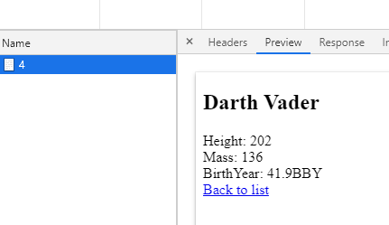
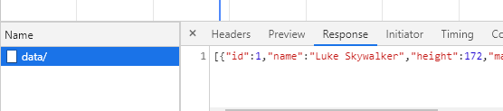

In the first [part](https://nede.dev/blog/integrating-react-into-aspnet-core-using-razzle-with-all-the-goodies-like-ssr-routing-code-splitting-and-hmr-part-1) of this article, we have created a React application with server-side rendering (SSR) in ASP.NET Core. We did not use the well-known library [ReactJS.NET](https://reactjs.net/) but instead went a different way that gives us greater flexibility. We helped ourselves with a tool called [Razzle](https://github.com/jaredpalmer/razzle) and used [Javascript.NodeJS](https://github.com/JeringTech/Javascript.NodeJS) to call NodeJS from ASP.NET Core.

In this part, we will add data loading to both the client and the server-side. We will look into code splitting and wrap up with a deployable package of our application.
<!-- end -->

## Data loading

We need to be able to access data on three occasions.

  - When the request first comes to the application, we need to return HTML containing a fully rendered page. For that, we need to provide data into our React application while rendering it on the server side using [renderToString](https://reactjs.org/docs/react-dom-server.html#rendertostring).

  - During hydration, we must render the same HTML on the client-side. That means we need the data again.

  - Finally, when we do a client-side routing, we need to load the data from the server using AJAX.

Let’s make a simple in-memory data provider that we will use in our HeroController.

```cs
public class HeroDb : IHeroDb
{
    private readonly Hero[] _items = new[]
    {
        new Hero{
            Id= 1,
            Name= "Luke Skywalker",
            Height= 172,
            Mass= 77,
            BirthYear= "19BBY",
        },
        ...
    };

    public Hero[] GetAll() => _items;
    public Hero Get(int id) => _items.SingleOrDefault(h => h.Id == id);
}
```

### Client-side data loading

First, we will focus on client-side routing, which is going to be the most straightforward part. We just need to be able to retrieve the data using AJAX. To simplify things, we will always load all the data for the current page using a single AJAX call.

Let’s add two additional actions to our controller.

```cs
public class HeroController : Controller
{
…
    [Route("data/")]
    public IActionResult IndexData() => Ok(_db.GetAll());

    [Route("/data/{id:int}")]
    public IActionResult DetailData(int id) => Ok(_db.Get(id));
}
```

Both actions correspond to actions that we created last time for SSR. Each has a "data/" prefix in its URL. This way, we have a convention for accessing page data based on the URL of the current page without any additional configuration. In a real-life application, we would merge data and non-data actions to a single action to prevent duplication. We could achieve it, for instance, by using URL rewrite, but that is outside of the scope of this article.

To keep the data loading on the client side in one place, we are going to introduce a simple higher-order component.

```js
const page = (WrappedComponent) =>
  ({ staticContext }) => {
    const location = useLocation();

    if (!staticContext) {
      useEffect(() => {
        fetch(`data${location.pathname}`)
          .then(r => r.json())
          .then(setPageData);
      }, [location]);
    }

    const [pageData, setPageData] = useState(null);

    return (
      pageData && <WrappedComponent pageData={pageData}></WrappedComponent>
    );
  };
```

We are retrieving the data using fetch API. The useLocation hook provided by React router is helping us to construct the URL. Note, that we are ignoring query string because we are not using it in our examples.

As you can see, we are retrieving data only if the staticContext is not set, which means that we are rendering the application on the client-side. We will use another way for the server-side later.
We are fetching data in an effect hook with location dependency to update data each time the location changes due to client-side routing.
In production code, we would also add cancelation of old requests and error handling, but we will omit it here to keep the example simple.

Thanks to page component, we can now easily add data into the HeroList and HeroDetail components.

```js
const HeroList = ({ pageData }) => (
  <div>
    <h2>List of heroes</h2>
    <div>
      <ul>
        {pageData.map(hero => (
          <li key={hero.id}>
            <Link to={`/${hero.id}`}>{hero.name}</Link>
          </li>
        ))}
      </ul>
    </div>
  </div>
);
export default page(HeroList);
```

```js
const HeroDetail = ({ pageData }) => (
  <div>
    <h2>{pageData.name}</h2>
    <div>
      Height: {pageData.height}
    </div>
    <div>
      Mass: {pageData.mass}
    </div>
    <div>
      Year of birth: {pageData.birthYear}
    </div>
    <div>
      <Link to="/">Back to list</Link>
    </div>
  </div>
);
export default page(HeroDetail);
```


### Server-side data loading and hydration

To add data loading on the server-side, we have to make small adjustments to SsrResult and RenderService classes.

```cs
public class SsrResult : IActionResult
{
    ...
    private readonly object _data;
    public SsrResult(string url, object data)
    {
        ...
        _data = data;
    }
    public async Task ExecuteResultAsync(ActionContext context)
    {
        ...
        var renderResult = await renderService.RenderAsync(_url, _data);
        ...
    }
}
```    

```cs
public class RenderService : IRenderService
{
    ...
    public Task<string> RenderAsync(string url, object data) => 
        _nodeJSService.InvokeFromFileAsync<string>(_serverJsPath, 
            args: new object[] { url, data });
}
```    

```cs
public class HeroController : Controller
{
    ...
    [Route("/")]
    public IActionResult Index() => new SsrResult("/", _db.GetAll());
    [Route("/{id:int}")]
    public IActionResult Detail(int id) => new SsrResult("/:id", _db.Get(id));
    ...
}
```    

We are receiving data in the SsrResult constructor and passing them straight into server.js through RenderService and INodeJSService.

We can now use the data in server.js to render the application.

```js
const server = (cb, url, data) => {
  const context = { data };
  const markup = renderToString(
    <StaticRouter context={context} location={url}>
      <App />
    </StaticRouter>
  );

    ...
  
  cb(null, `<!doctype html>
      <html lang="">
      <head>
          ...
          <script>window.__ROUTE_DATA__=${JSON.stringify(data)}</script>
          ...
      </head>
      ...
    </html>`);
}
```    

We are passing received data into the context of the StaticRouter and thus making it available to our page component. By using an inline script, we are assuring that we can access the data also during hydration.

We are ready to take advantage of the data in our page higher-order component during SSR and hydration.

```js
const page = (WrappedComponent) =>
  ({ staticContext }) => {
    const location = useLocation();

    let initData = null;
    if (staticContext) {
      initData = staticContext.data;
    } else if (window.__ROUTE_DATA__) {
      initData = window.__ROUTE_DATA__;
      delete window.__ROUTE_DATA_;
    }

    if (!staticContext) {
      useEffect(() => {
        if (!initData) {
          fetch(`data${location.pathname}`)
        ...
```    

We are retrieving the data from the staticContext (during SSR) or the \_\_ROUTE\_DATA\_\_ window field (during hydratation). You might have noticed that we are clearing the \_\_ROUTE\_DATA\_\_ field after filling the initData variable. This way, we ensure that the initial data is used only during hydration and not for another page during client routing.

Let’s check the browser. When we open the https://localhost:5000/4 URL, we can see that the initial request contains fully rendered HTML with all the data.



When we navigate to the list using the “Back to list” link, we can see that only an AJAX call was executed.



## Code splitting

We have fully functional SSR now. It's time to add a cool feature that is currently not supported by [ReactJS.NET](https://reactjs.net/) - code splitting. Code splitting enables us to split our scripts into multiple chunks and lazy load them only when necessary. That means faster load times for our users.

We are going to use the [Loadable Components](https://loadable-components.com) library that, unlike [React.lazy](https://reactjs.org/docs/code-splitting.html#reactlazy), also supports SSR. Thankfully, Razzle has a nice [example](https://github.com/jaredpalmer/razzle/tree/master/examples/with-loadable-components) for Loadable Components, so our work will be rather easy.

First, we need to install a few dependencies.

```sh
npm i @loadable/component @loadable/server -d
npm i @loadable/babel-plugin @loadable/webpack-plugin -D
```

Now we can update razzle.config.js to include the installed Loadable Webpack plugin using the following code.

```js
if (target === "web") {
    const filename = path.resolve(__dirname, "build");
    config.plugins.push(
        new LoadableWebpackPlugin({
            outputAsset: false,
            writeToDisk: { filename },
        })
    );
}
```

Loadable Components also requires a Babel plugin (@loadable/babel-plugin) for SSR to function properly. Razzle supports modifications to Babel config through a ".babelrc" file in the folder where the razzle.config.js is. Razzle will then automatically pick it up during its initialization.

```js
{
    "presets": [
        "razzle/babel"
    ],
    "plugins": [
        "@loadable/babel-plugin"
    ]
}
```

We are using the razzle/babel preset, which will give us all the defaults provided by Razzle, so we don’t have to configure them manually.

Next, we need add chunk extractor from Loadable Components into server.js file.

```js
const server = (cb, url, data) => {
  const context = { data };
  const extractor = new ChunkExtractor({
    statsFile: path.resolve(__dirname, 'loadable-stats.json'),
    entrypoints: ['client'],
  });
  const markup = renderToString(
    <StaticRouter context={context} location={url}>
      <ChunkExtractorManager extractor={extractor}>
        <App />
      </ChunkExtractorManager>
    </StaticRouter>
  );

  const scriptTags = extractor.getScriptTags();
  const linkTags = extractor.getLinkTags();
  const styleTags = extractor.getStyleTags();

  cb(null, `<!doctype html>
      <html lang="">
      <head>
          <meta http-equiv="X-UA-Compatible" content="IE=edge" />
          <meta charset="utf-8" />
          <title>Welcome to Razzle</title>
          <meta name="viewport" content="width=device-width, initial-scale=1">
          <script>window.__ROUTE_DATA__=${JSON.stringify(data)}</script>
          ${linkTags}
          ${styleTags}
      </head>
      <body>
          <div id="root">${markup}</div>
          ${scriptTags}
      </body>
    </html>`);
}
```

Notice that we have also replaced assets in the HTML template with the ones that come from the chunk extractor.

We want to lazy load both our pages, so we need to wrap their imports in the App.js file with the loadable function provided by Loadable Components.

```js
const HeroList = loadable(() => import('./HeroList'))
const HeroDetail = loadable(() => import('./HeroDetail'))
```

To wait for all asynchronously loaded scripts required to render the application, we must also wrap the hydrate call in client.js with the loadableReady function.

```js
loadableReady().then(() => {
  hydrate(
    ...
  );
});
```

With that, we finished the integration of the code splitting into our application. Notice that we did not have to do anything special just because we are using ASP.NET Core as our backend, which is awesome.

## Publishing the application

In the previous part of the article, we have bootstrapped our application using the standard React template provided by ASP.NET Core. Thanks to this, the publish profile was created for us, and we don’t need to change a single line in it. If we open the csproj file, we can see that the PublishRunWebpack target runs

```sh
npm install
```

and then

```sh
npm run build
```

The build npm script was created in package.json automatically by create-razzle-app when we bootstrapped the client side of our application.

The only thing that we need to do is a small modification of the Webpack configuration. Razzle is using [webpack-node-externals](https://github.com/liady/webpack-node-externals) to exclude all node\_module packages from the server bundle. It makes sense for a NodeJS backend, but in our case, it would just make things harder during deploy. We would need to copy package.json, package-lock.json, and install packages on the destination server. It is much easier for us to let Webpack bundle all the dependencies into the resulting package – we are not using any dependency that couldn’t be bundled like this.

Let’s do a final modification to razzle.config.js.

```js
if (dev) {
    ...
} else {
    if (target === 'node') {
        config.externals = [];
    }
}
```

You can read more about Webpack externals in the [official documentation of Webpack](https://webpack.js.org/configuration/externals/).

And we are done. Execute the publish using the following command.

```sh
dotnet publish
```

The result is a fully functional package of our application.

## Conclusion

This concludes our SSR React + ASP.NET Core backend integration. What I personally really like about this way is that we are free to use any React library that requires special handling for the SSR to function. We can use cool stuff like code splitting and most likely anything that will Webpack provide in the future because we have nicely decoupled the ASP.NET Core backend and the Webpack/React part.

You can access the complete code of the example application here https://github.com/pruttned/AspNetCoreReactRazzleExample .
