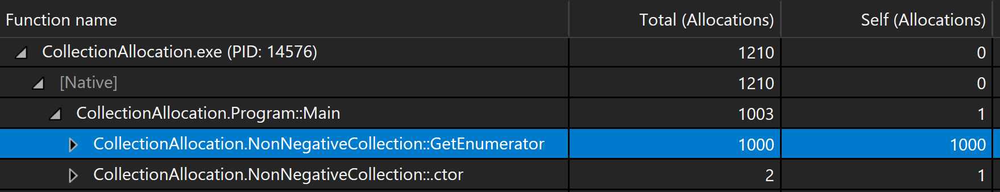

.NET is doing a really good job in the case of memory management, and usually, you don’t have to think about it at all. But if you are creating an application where performance really matters, for instance, a game in Unity, then it is important to have allocations in check. Sometimes you will be surprised how a rather innocently looking code could do a lot of allocations and mess with the performance. Let’s look into a few such cases.
<!-- end -->

## Heap vs. Stack

Before we jump straight to examples, let’s first take a quick detour to grasp some basics of memory management in .NET.

In .NET, we have two kinds of types - Reference types (class) and value types (e.g., struct).

Reference types are allocated on the heap, while value types (when used for parameters, local variables, or return values) are allocated on the stack.

You can perceive stack as a LIFO (last in first out) structure of blocks (stack frames) containing the method being executed, its parameters, and local variables. Each time a method execution finishes, its frame is removed from the top of the stack. This removal is done outside of .NET garbage collection.

Heap is a memory place where you can allocate much bigger memory blocks and keep them alive as long as you need them. Garbage collection is responsible for freeing memory allocated on the heap. Disadvantage is that the garbage collection is slower then removing objects from the stack.

When we are writing a performance-critical code, we should prevent unnecessary heap allocations. 

## IEnumerable and heap allocations

Suppose that we are creating a custom collection, and we would like to be able to enumerate over it. For our example, we are going to create a simple wrapper over List\<float\> whose purpose is to prevent negative numbers in the collection.

```cs
public class NonNegativeCollection : IEnumerable<float>
{
    private List<float> mItems = new List<float>(10);
    public void Add(float value) => mItems.Add(Math.Abs(value));
    IEnumerator IEnumerable.GetEnumerator() => mItems.GetEnumerator();
    public IEnumerator<float> GetEnumerator() => mItems.GetEnumerator();
}
```

We have an internal list of items, Add method that is doing all the hard work and methods for implementing IEnumerable\<float\>.

Now let’s put our new and shiny collection to good use.

```cs
var collection = new NonNegativeCollection
{
    -1.1f, 1.1f,
};
// game loop
for (int i = 0; i < 1000; i++)
{
    var sum = 0f;
    foreach (var item in collection)
    {
        sum += item;
    }
}
```

We are creating an instance of our collection filled with numbers, and then we are computing the sum of them (yes without Linq ). We are doing this multiple times to simulate a game loop or a complex computation. How many allocations would you expect to be happening in this simple code? There is, of course, the obvious one, the allocation of the NonNegativeCollection class. But it happens outside of the game loop. Let’s open a memory profiler to check if there are any other allocations.



As you can see, apart from expected NonNegativeCollection allocation, we have 1000 allocations from GetEnumerator method. One for each iteration in the game loop.

We must be doing something wrong.

We are returning an enumerator from our inner mItems List in the GetEnumerator method. If we check the type of this enumerator, we can see that it is a structure. So why do we see allocations on the heap? The reason for this is boxing. It happens each time we convert a value type to System.Object, or to an interface. In our GetEnumerator implementation, we are returning the enumerator as an IEnumerator\<float\>. Because of this, the enumerator instance is moved onto the heap.

### Let’s fix it

The fix is rather simple. According to [documentation on foreach loop](https://docs.microsoft.com/en-us/dotnet/csharp/language-reference/keywords/foreach-in), we don’t have to implement IEnumerable if we wish to support foreach loop. All we need is to have a public parameterless GetEnumerator method that returns an enumerator. Let’s change GetEnumerator to implicit interface implementation and provide another GetEnumerator method that returns List\<float\>.Enumerator. Our resulting code looks like this.

```cs
public class NonNegativeCollection : IEnumerable<float>
{
    //...
    public List<float>.Enumerator GetEnumerator() => mItems.GetEnumerator();
    IEnumerator<float> IEnumerable<float>.GetEnumerator() => 
      mItems.GetEnumerator();
}
```

In reality, we could even remove the whole IEnumerable\<float\> implementation and still be able to use foreach loop on our collection class, but I prefer to keep it there to make it explicit that the class supports enumeration.

If we run the memory profiler again, we would see that the extra heap allocations are gone (there is no boxing anymore), and we have gained some precious performance.

## Casting collection to IEnumerable

Let’s say that we want to make our sum computation reusable and to support also other collection types. Therefore we will move the sum computation to a separate method, and we will define its parameter as IEnumerable\<float\>.

```cs
private static float Sum(IEnumerable<float> collection)
{
    var sum = 0f;
    foreach (var item in collection)
    {
        sum += item;
    }
    return sum;
}
```

After running the memory profiler again, we see that we are again doing heap allocations. It is happening because we are casting the input collection to IEnumerable\<float\>. Therefore we are again using IEnumerable\<float\>.GetEnumerator() method and thus doing boxing.

How to solve this case? Sadly, there is no silver bullet for this problem, at least none, that I’m aware of.

We could partially solve it in multiple ways:

  - We could create a separate method for each collection type, which would cause a lot of duplicate code.

  - We could replace IEnumerable\<float\> parameter with, e.g., IReadOnlyList\<float\> (with Count and indexer) and use for-loop instead of foreach. But this is limiting the usage of our sum method.

  - We could create a new IEnumerable interface that would return an Enumerator structure via generic type.


```cs
public struct NonGcEnumerator<TEnumerator, TValue> : IEnumerator<TValue>
    where TEnumerator : IEnumerator<TValue>
{
    private TEnumerator mEnumerator;
    public TValue Current => mEnumerator.Current;
    object IEnumerator.Current => mEnumerator.Current;
    public NonGcEnumerator(TEnumerator enumerator)
    {
        mEnumerator = enumerator;
    }
    public bool MoveNext() => mEnumerator.MoveNext();
    public void Dispose() { }
    public void Reset()
    {
        mEnumerator.Reset();
    }
}
public interface INonGcEnumerable<TEnumerator, TValue>
    where TEnumerator : IEnumerator<TValue>
{
    NonGcEnumerator<TEnumerator, TValue> GetEnumerator();
}
public class NonNegativeCollection : 
INonGcEnumerable<List<float>.Enumerator, float>
{
    private List<float> mItems = new List<float>(10);
    public void Add(float value) => mItems.Add(Math.Abs(value));
    public NonGcEnumerator<List<float>.Enumerator, float> GetEnumerator() =>
        new NonGcEnumerator<List<float>.Enumerator,float>
 	(mItems.GetEnumerator());
}

private static float Sum(INonGcEnumerable<List<float>.Enumerator, 
float> collection)
{
    var sum = 0f;
    foreach (var item in collection)
    {
        sum += item;
    }
    return sum;
}
```

This way, we can define GetEnumerator with a non-interface return type and still be able to do it a general way.

## Linq

Up to this point, we were ignoring the fact that in .NET, we have a built-in method for computing the sum of items in a collection. For that, we use the Sum extension method provided by System.Linq namespace.

The problem with System.Linq, in our case is, that all the methods are provided as an extension method on IEnumerable\<T\> interface. E.g., the Sum method looks like this.

```cs
namespace System.Linq
{
    public static class Enumerable
    {
        ...
        public static float Sum(this IEnumerable<float> source);
        ...
    }
    ...
}
```

Therefore if we used Sum provided by Linq, we would be back on doing allocation on the heap due to boxing. In general, if you are creating a game or something similar, you should sadly forget about the entire Linq in performance-critical parts.

## Conclusion

We have looked in a few cases, where .NET is doing unwanted heap allocations that are rather easy to miss. In most cases, you don’t have to care, because the garbage collector is rarely a performance bottleneck. But if you are creating a game, then you should pay attention to boxing and always check a memory profiler if you are not sure.

