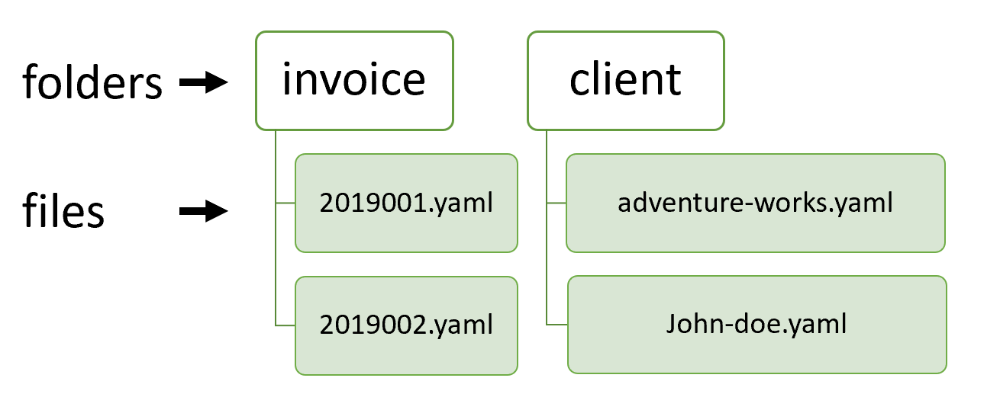

Today when you are creating an application, you have many options for a database to choose from.  
What you might not realize is that you could consider Git as one of the options with some great advantages. Why and how would you do that? Well, read ahead.
<!-- end -->

Recently I was creating a simple invoicing application with my brother as a personal project for our needs. From the very beginning, we intended to run our application locally in a single-user mode, but we required to be able to access data from multiple places.

In the past, we discussed the possibilities of using file system along with Git to create a simple, yet powerful database, so we decided to use this opportunity to make a proof of concept of this idea. 

## Why Git?

Let’s look at the benefits of using Git backed filesystem as an application database.

  - History - Let\`s face it, managing history in common database is usually not fun. You\`ll end up with tables full of records where you must check dates just to get the currently active record. Or you must move records to historical tables. Either way, it is tedious. But with Git, you\`ll get history basically for free. You are even able to compare versions, and you also know who, when, and why did the change.

  - Hosting for free – Today, you can create a private repo in Bitbucket and Github without any costs. Compared to ordinary database free hostings, there are no row constraints, no read/write constraints, and I consider both Github and Bitbucket reliable providers.

  - Human readable data store - By storing data in plain text files, you can read and even edit data with your favorite text editor. Thanks to this, you can quickly hack some data, or rapidly prototype new features. E.g., you need to clone an old invoice, and you still had no time to implement this feature into your application? No problem, simply copy the file, open your favorite text editor, and you are done. It\`s much easier than in most database admin tools.

  - Distributed and disconnected database - Great thing about Git is its distributed nature. Each local repository contains the full history. If one of the repositories dies, it doesn't usually mean a loss of data. It is also possible to work in offline mode without any additional headaches.

  - Merging of conflicts - When two users change the same entity, there must be a conflict resolution. That often means that either the later change wins or the first one. Git, on the other hand, gives users the ability to merge conflicts manually and in many cases, can merge changes automatically.

Now, when we know what the benefits of a Git application database are, let us dive into implementation.

## How to store documents

First, we need to decide how we are going to model our database. We will use folders for collections and files for documents.



This way, it is easy to collect all the entities stored in one collection, and it is also more readable for a human. We are going to use a non-bare repository, so we will be able to access files directly, which I consider to be a big advantage.

Let\`s point out here an interesting article <https://www.kenneth-truyers.net/2016/10/13/git-nosql-database/> that is also dealing with the concept of using Git as a database, but instead is using bare repositories.

To speed up lookups, we are going to store document ID directly in the file name. This way, it is not necessary to open a file to get the ID. And it is again more readable for a human. It would also be possible to store more fields in the file name and thus make a sort of index.

As a file format for document files, we will use YAML. YAML is great for serializing data while keeping them human-readable, so checking diffs in the Git history will be easier for us.

## Let\`s have some performance

Ok, so now when we have our file structure, to have any sense of speed, we need caching. We are going to do caching on two levels. First, we will cache collection and then also individual documents.

Caching of individual documents is more interesting, so let us start with that. We should better not keep documents in memory forever, but rather they should have TTL (time to live) specified. For actual implementation, we will use [node-cache](https://www.npmjs.com/package/node-cache) library.

```js
async function getDocument(collection: string, id: string): Promise<any> {
  const documentCacheKey = getDocumentCacheKey(collection, id);
  let document = documentCache.get(documentCacheKey);
  if (!document) {
    const file = getDocumentPath(collection, id);
    const fileContent = await readFile(file, 'utf-8');
    document = yaml.safeLoad(fileContent) || {};
    (document as any)['id'] = id;
    documentCache.set(documentCacheKey, document);
  }
  return document;
}
function getDocumentCacheKey(collection: string, id: string) {
  return `${collection}-${id}`;
}
function getDocumentPath(collection: string, id: string) {
  return path.join(baseDir, collection, `${id}.yaml`);
}
```


First, we retrieve the cache key for a given document. For this, we concatenate the collection (folder) name and ID of the required document. We then use this key to access the document in the cache. If it is not there, we need to load it from the file system and then store it in the cache under our cache key.

For parsing YAML files, we will use [js-yaml](https://www.npmjs.com/package/js-yaml) library.

For caching collections, a simple dictionary of arrays is enough. We don’t need TTL in this case, because we will query collections more often than actual documents and actual content in memory is rather small.

```js
async function getCollection(collection: string): Promise<string[]> {
  if (!collectionCache[collection]) {
    collectionCache[collection] =
      (await glob(path.join(baseDir, collection, '*.${yaml}')))
        .map(p => ({
          id: path.basename(p, path.extname(p)),
          path: p
        }));
  }
  return collectionCache[collection]!
    .map(f => f.id);
}
```

## Text editor to the rescue

Because we have all documents nicely accessible from the file system, it would be a shame not to support changes outside of the application. This way, it is possible to handle usability patterns, that we are not directly supporting in the application. E.g., as we said previously, we will be able to copy invoices before adding this feature into the application.

For this, we are going to introduce file watcher using [chokidar](https://www.npmjs.com/package/chokidar) library.

```js
watcher = chokidar.watch(`**/*.yaml`, { cwd: baseDir });
watcher
  .on('add', file => onChange(file, 'add'))
  .on('unlink', file => onChange(file, 'unlink'))
  .on('change', file => onChange(file, 'change'));

function onChange(file: string, changeType: 'add' | 'unlink' | 'change') {
  const collection = path.basename(path.dirname(file));
  const id = path.basename(file, path.extname(file));
  invalidateDocumentInCache(collection, id, changeType !== 'change');
}
function invalidateDocumentInCache(collection: string, id: string,
  invalidateCollectionCache: boolean) {
  const documentCacheKey = getDocumentCacheKey(collection, id);
  documentCache.del(documentCacheKey);
  if (collectionCache && invalidateCollectionCache) {
    collectionCache[collection] = null;
  }
}
```

In case of detecting a change to a YAML file, we remove it from the node-cache. If the file is removed, added, or renamed (add + unlink), then we also clear the whole collection in the collection cache.

## Let\`s search

Finally, we have everything prepared for doing an actual querying. We are going to do it on two levels. Query by ID and by content. We will use the [micromatch](https://www.npmjs.com/package/micromatch) library for querying by ID.

```js
async function getAllIds(query?: IdQuery): Promise<string[]> {
  let ids = await getCollection(collectionName);
  if (query && query.id) {
    ids = ids.filter(d => micromatch.isMatch(d, query.id!));
  }
  return orderBy(ids, 'id');
}
```

Micromatch enables us to run simple queries based on ID. E.g., in the case of invoices, each ID consists of year and number in the specific year, so it looks like this "201933". To get all invoices created in a specific year, we can use "${year}\*" query.

For querying by content of files, we are going to use simple filtering.

```js
let docs = await Promise.all(
    collection.map(doc => doc.getDocument(collectionName, doc)));
if (query && query.where) {
  docs = docs.filter(query.where)
}
```


## Save it & load it  

To keep local and remote Git repositories in sync, we need to pull and push regularly. For a single page application, the best time to pull is during page refresh. It is possible to push after each change, so the remote repository is updated as soon as possible. For actual Git handling, we are going to use [simple-git](https://www.npmjs.com/package/simple-git) library, which makes git operations easy.

```js
async function pull(): Promise<any> {
  await ensureRepo();
  await repo!.pull();
}
async function commitAndPush(message: string): Promise<any> {
  await ensureRepo();
  await repo!.add('.');
  var commitRes = await repo!.commit(message);
  var pushRes = await repo!.push();
}
async function ensureRepo() {
  if (!repo) {
    repo = simplegit(db.dir);
  }
}
```

And then in actual update code:  
 
```js
async function update(invoice: InvoiceUpdateModel): Promise<InvoiceDocument> {
  let invoiceDocument = await db.invoices.single(invoice.id);
  invoiceDocument = { ...invoiceDocument, ...invoice };
  invoiceDocument = await db.invoices.update(invoiceDocument);
  await repoService.commitAndPush(`invoice(${invoice.id}):updated`);
  return invoiceDocument;
}
```

## Conclusion

I must say that I\`m happy with the result. For this specific use case, git works quite nice as a database for application data. Of course, the performance is much lower compared to common database solutions. The whole concept would also be far from ideal in case of an application hosted on a remote server because it would make dealing with conflicts much more difficult. But on the other hand, it is really simple, cheap and it gives us the ability to do quick hacking of documents.

You can access the whole code of the invoicing application here <https://github.com/pruttned/owl-invoice>
